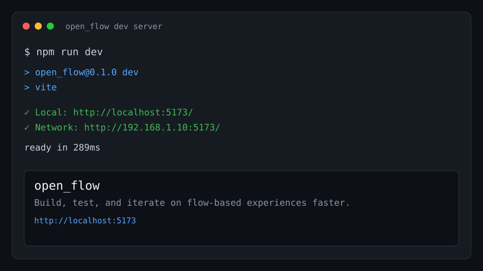

# open_flow

A lightweight open-source starter for building and shipping flow-based web experiences quickly.



## Quick Start

```bash
git clone https://github.com/Sanmati-Ukhalkar/open_flow.git
cd open_flow
npm install
npm run dev
```

## Why this exists

Most early projects fail to attract users or contributors because they are hard to run and unclear in purpose. `open_flow` exists to provide a simple, contributor-friendly baseline with clear setup and collaboration conventions so people can see it work fast and start helping immediately.
