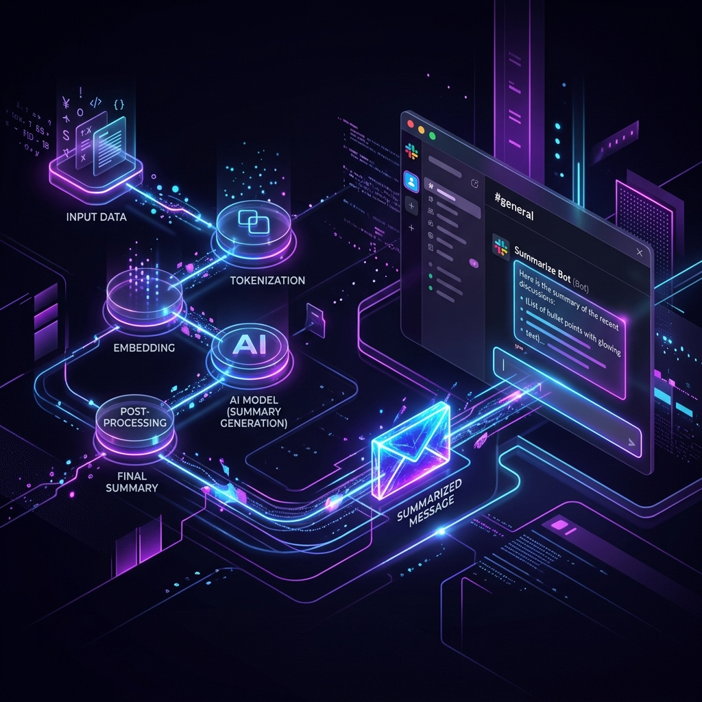
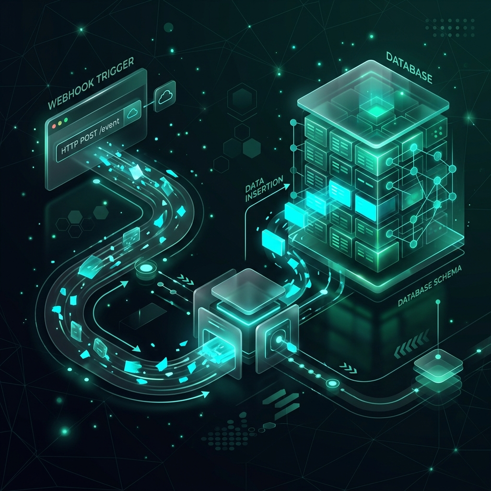
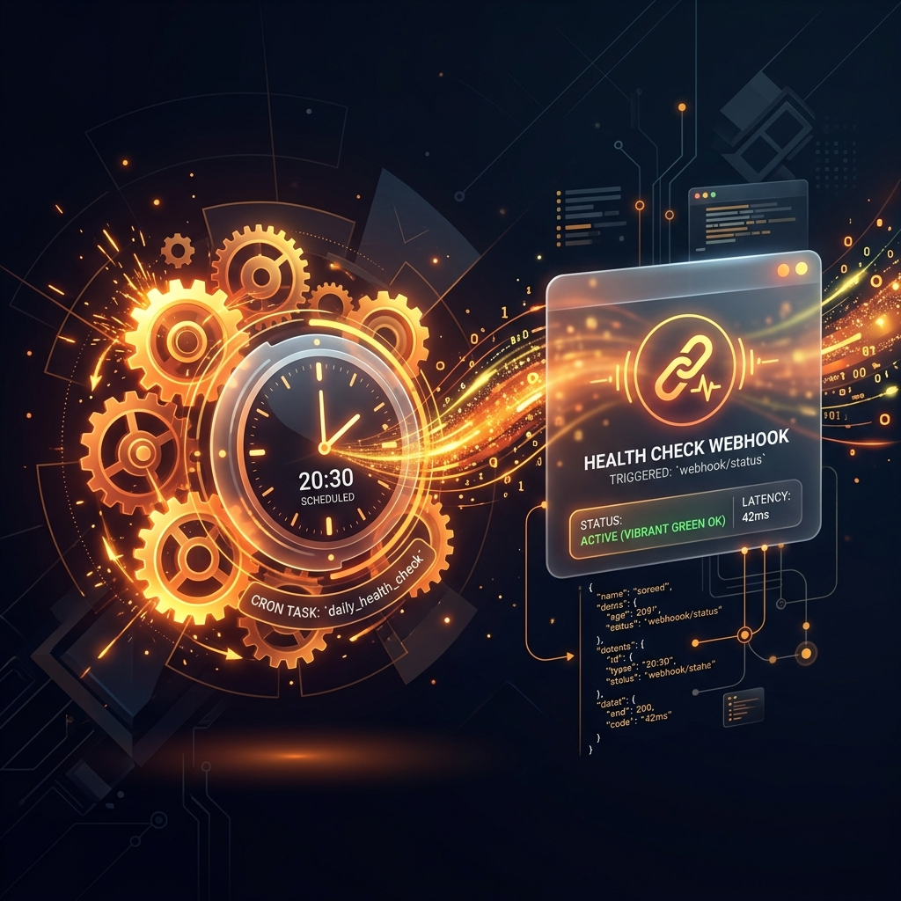
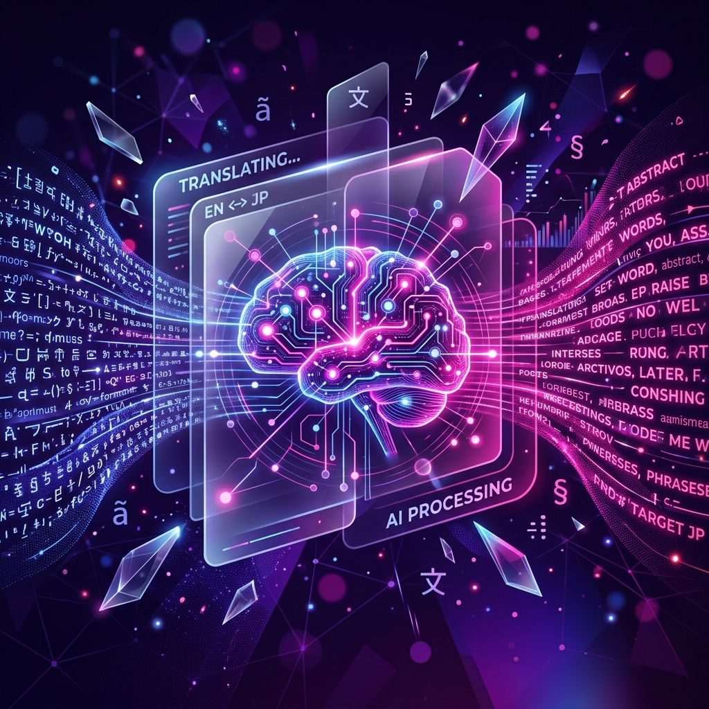
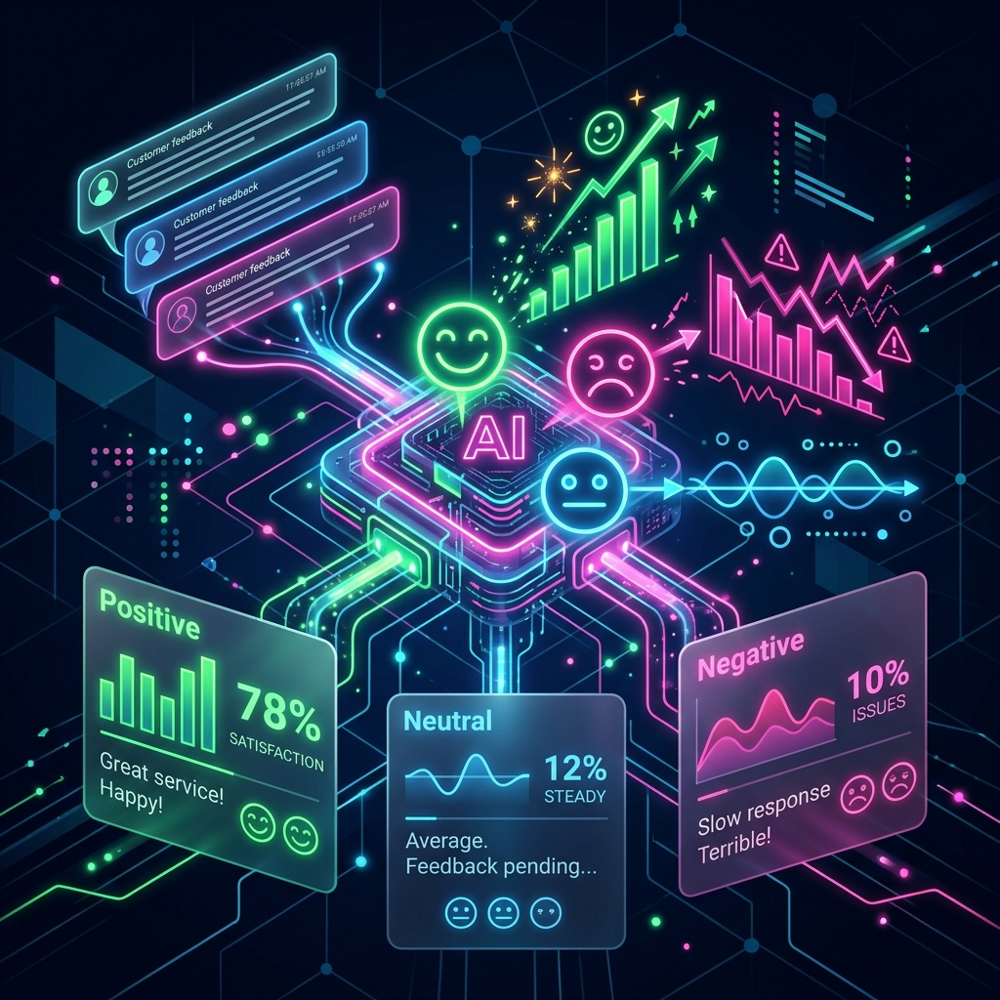
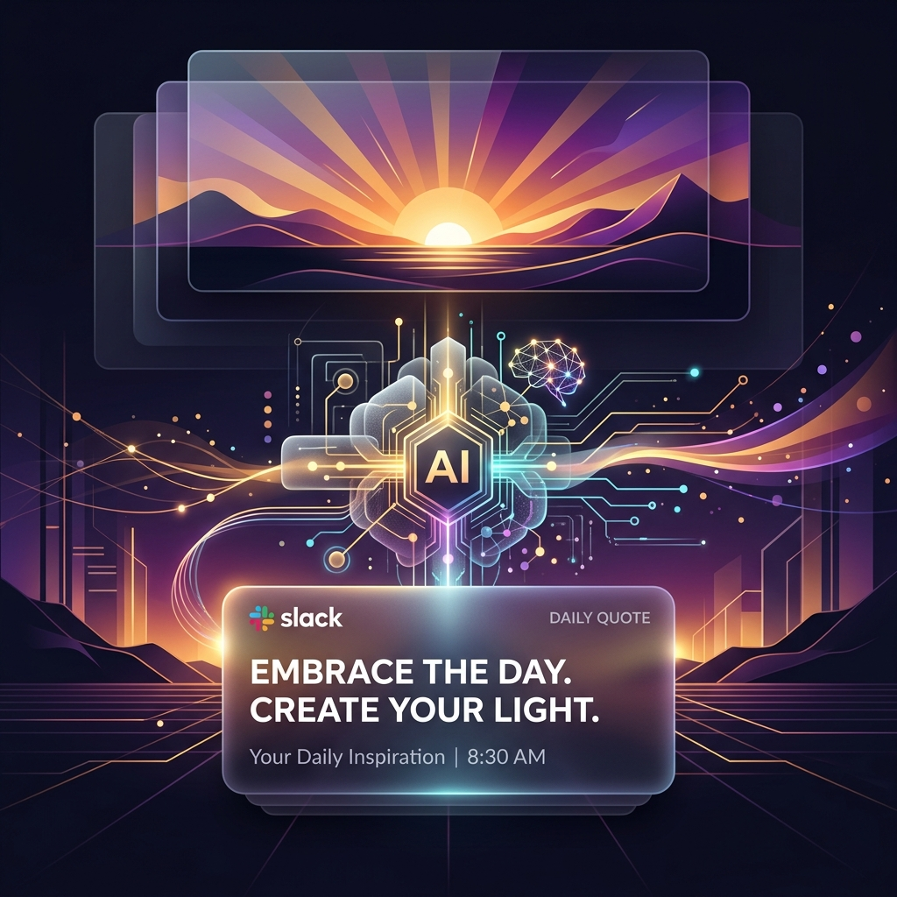

# Open Flow 🌊

**A visual, no-code, drag-and-drop workflow builder — built AI/MCP-first from the ground up, not bolted on as an afterthought.**

> Think "n8n for MCP": a canvas where you chain AI tool-calls, MCP servers, and everyday automation steps together, without writing code.

[](https://github.com/Sanmati-Ukhalkar/open_flow/actions)


[](docs/VIDEO_WALKTHROUGH.md)

---

## 🚀 Why Open Flow

Developers and teams juggle a fragmented toolkit today: coding assistants, separate AI-orchestration frameworks (LangChain, MCP servers), and separate automation tools (n8n, Zapier). Nothing connects them well, so the same integration patterns get rebuilt from scratch every time.

Most existing visual workflow tools were built **automation-first**, with AI features added on top later. Open Flow flips that: the node model, the canvas, and the execution engine are designed around AI tool-calling and MCP servers as the default case — not a plugin bolted onto a generic automation tool.

**Why not just use n8n?** n8n is automation-first with AI added on; Open Flow is AI/MCP-first from the ground up.

---

## ⚙️ What It Does

Drag nodes onto a canvas, connect them, configure them, hit run. A typical workflow might look like:

```
Webhook Trigger → PDF OCR → LLM Extraction → SQLite Storage → Slack Notification
```

Every node is:
- **Real**, not mocked — an LLM node actually calls OpenAI, an MCP node actually calls a real MCP server.
- **Composable** — outputs from one node feed into the next, branches run independently, multi-input nodes merge upstream data.
- **Shareable** — nodes follow a standard package format (`definition.json` + `run.ts` + `README.md`) so anyone can build and contribute new ones.

---

## 🖼️ Starter Templates

Kickstart your workflow automations with these gorgeous, pre-configured blueprints:

### Summarize and Slack it
*Takes input text, uses an LLM to generate a concise summary, and posts the result to a Slack webhook.*  


### Data-to-SQLite Logger
*Listens for incoming HTTP webhook requests and logs the payload directly into a local SQLite database table.*  


### Basic Cron Task
*Runs on a scheduled interval (e.g., every 5 minutes) and pings a health-check or heartbeat URL.*  


### AI Text Transformer
*Takes a webhook input, transforms it using an LLM, and formats the output.*  


### Customer Feedback Sentiment Analysis
*Listens for customer feedback via webhook, analyzes the sentiment (Positive/Neutral/Negative) using an LLM, and stores the structured result into a local database.*  


### Daily Inspirational Slack Quote
*A daily morning task that prompts an LLM for an inspiring quote and sends it to Slack.*  


---

## 🖼️ UI Walkthrough

Here are some of the important steps and usable screens captured during the main workflow of the OpenFlow application.

### 1. Initial Canvas
The initial view of the workflow canvas where users can start building their automations.  


### 2. Adding a Node
Drag and drop nodes from the sidebar onto the canvas. Here, an LLM Prompt node has been added to the canvas.  


### 3. Node Configuration
Clicking on a node opens its configuration panel where you can edit its settings.  


### 4. Execution Output
Running the workflow processes the nodes and displays the execution output at the bottom of the screen.  


---

## 🛠 Features & Status

Open Flow was built version by version, with each version shipping something fully working before the next begins.

| Version | Status | What it adds |
|---|---|---|
| v0.1 | ✅ Shipped | Canvas + one real node (LLM Prompt), full run loop |
| v0.2 | ✅ Shipped | Second node type (MCP Tool), node-to-node data flow |
| v0.3 | ✅ Shipped | Node library/sidebar, 5 node types, multi-input support |
| v0.4 | ✅ Shipped | Parallel branches, per-node retry, run log, output validation |
| v0.5 | ✅ Shipped | Save/load workflows, basic auth, server-side execution |
| v0.6 | ✅ Shipped | Deploy a workflow as a public API endpoint |
| v0.7 | ✅ Shipped | Cron/webhook triggers, community node marketplace |
| v0.8+ | ✅ Shipped | Teams, RBAC, real-time collaboration (Yjs), observability & token usage analytics, templates |

See [`ARCHITECTURE.md`](./ARCHITECTURE.md) for the full architecture history.

---

## 🧩 Node Types (so far)

| Node | What it does |
|---|---|
| **LLM Prompt** | Calls OpenAI (or other providers) with a configurable prompt and model |
| **MCP Tool** | Executes a tool exposed by a connected MCP server |
| **Text Transform** | Combines/formats multiple upstream inputs into one output |
| **SQLite Storage** | Appends a row of data to a local SQLite table |
| **HTTP Webhook** | Fires a POST request (e.g. a Slack-compatible webhook) |
| **Cron Trigger** | Automatically executes workflows on a scheduled interval |
| **Webhook Trigger** | Instantly executes workflows upon receiving HTTP POST requests |

More node types are planned — see [`CONTRIBUTING.md`](./CONTRIBUTING.md) for how to build and submit your own.

---

## 💻 Tech Stack
- **Frontend:** React, Vite, TailwindCSS, React Flow, Yjs
- **Backend:** Node.js, Express, WebSocket, SQLite
- **Execution:** In-process async node runners
- **AI Integrations:** LLMs (OpenAI SDK), Model Context Protocol (MCP)

---

## 📦 Quick Start

### Option A: Local Node Development
```bash
git clone https://github.com/Sanmati-Ukhalkar/open_flow.git
cd open_flow
npm install
cp .env.example .env   # add your OpenAI API key
npm run dev
```
Visit `http://localhost:5173`, create a Team, drag a node onto the canvas (or clone a starter template!), and hit **Run Workflow**.

### Option B: Self-Hosting with Docker Compose
If you have Docker installed, you can launch a local OpenFlow instance in the background with a single command:
```bash
docker compose up --build
```
This builds and starts both the frontend and backend containers, persisting your local SQLite database data.

---

## 🤝 Contributing

Open Flow is actively evolving — contributions, bug reports, and node ideas are welcome. Start here:

1. Read [`ARCHITECTURE.md`](./docs/ARCHITECTURE.md) to understand the project architecture.
2. Read the [Node-Authoring Guide](./docs/NODE_AUTHORING_GUIDE.md) to learn how to implement custom nodes.
3. Check the [API Reference Docs](./docs/API_REFERENCE.md) to integrate deployed workflows with your external applications.
4. Read [`AGENTS.md`](./AGENTS.md) if you're using an AI coding assistant (Claude Code, Cursor, etc.) to contribute.
5. See [`CONTRIBUTING.md`](./CONTRIBUTING.md) for local dev guidelines and PR checklists.

## 📄 License

MIT — see [`LICENSE`](./LICENSE) for details.

*Built for the future of AI automation.*