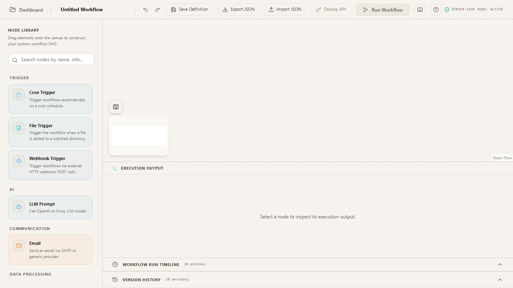
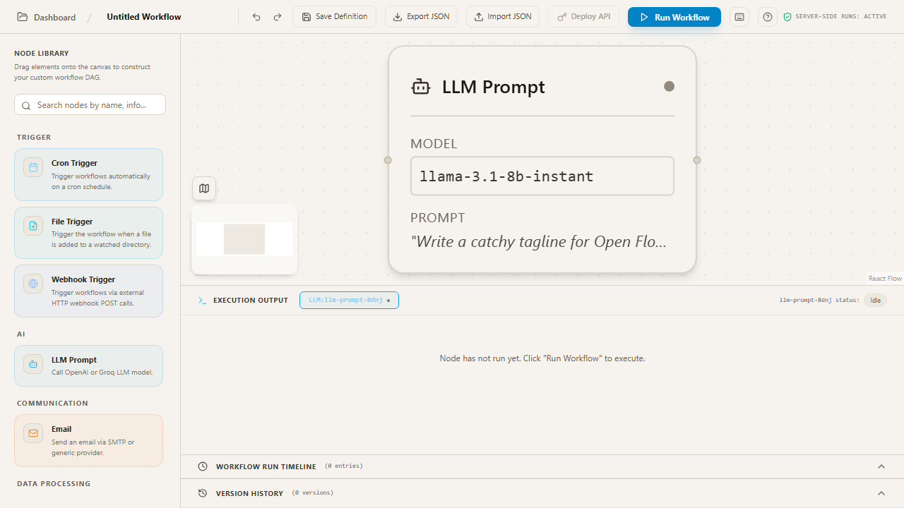
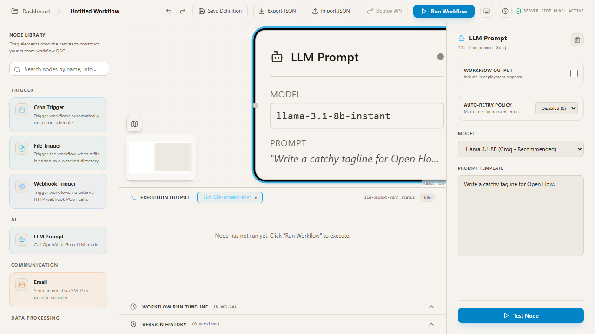
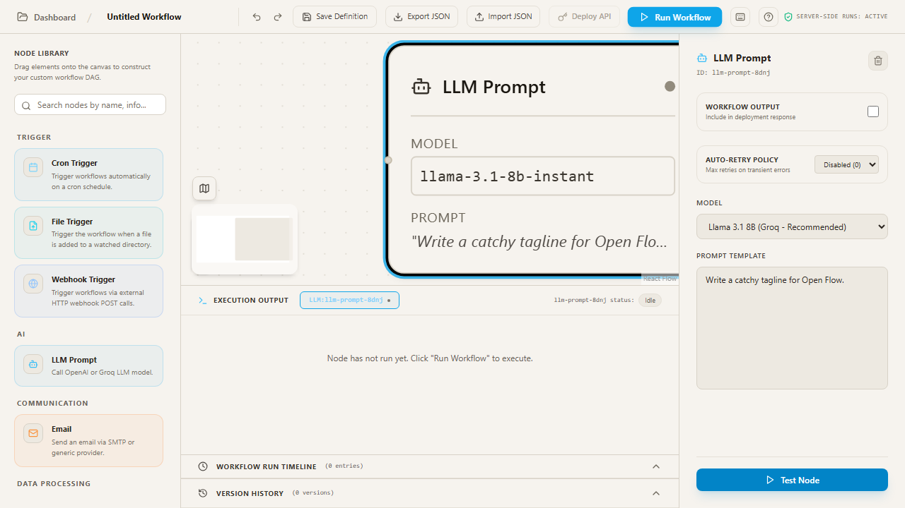

# UI Screenshots

Here are some of the important steps and usable screens captured during the main workflow of the OpenFlow application.

## 1. Initial Canvas
The initial view of the workflow canvas where users can start building their automations.

## 2. Adding a Node
Drag and drop nodes from the sidebar onto the canvas. Here, an LLM Prompt node has been added to the canvas.

## 3. Node Configuration
Clicking on a node opens its configuration panel where you can edit its settings.

## 4. Execution Output
Running the workflow processes the nodes and displays the execution output at the bottom of the screen.

