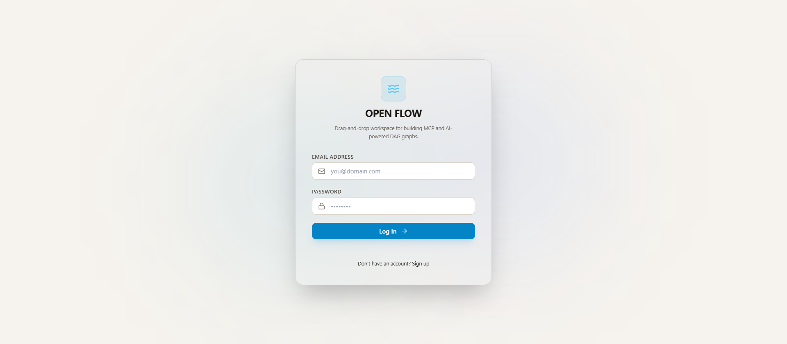
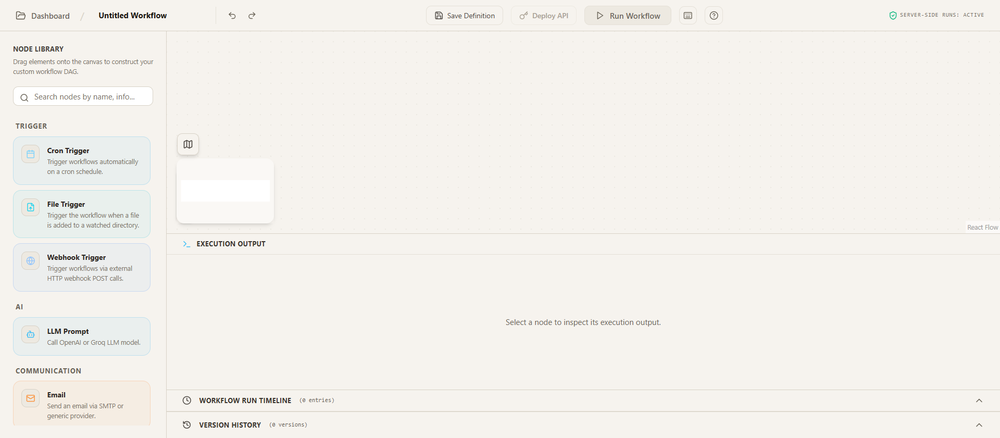

# Platform Use Cases & User Guide 🌊

Welcome to **Open Flow**, a visual, no-code, drag-and-drop workflow builder built AI/MCP-first from the ground up. This guide covers all use cases of the platform, walking you through every feature from logging in to deploying production workflows.

---

## 1. Authentication & Session Management

Open Flow's secure authentication ensures that workspace configurations, credentials, and execution environments are completely isolated.

### Landing / Authentication Screen

### Use Case 1.1: Registering a New Account
- Navigate to the landing page.
- Select the **Register** tab.
- Enter your Email and a secure password.
- Click **Register** to create your account.

### Use Case 1.2: Logging In
- Select the **Login** tab on the authentication screen.
- Enter your credentials.
- Click **Login**.
- *Under the hood:* The platform hashes passwords using PBKDF2 with 210,000 iterations and HMAC-SHA512. If your account had an older hash from a previous version, Open Flow transparently upgrades it to the secure format during successful login.

---

## 2. Team Workspace & Collaboration

Workspaces isolate workflow DAGs, credentials, and run logs by organizational boundary.

### Use Case 2.1: Creating a Team Workspace
- Click the Organization drop-down in the top navigation bar.
- Click **Create Workspace / Manage Org**.
- Input a workspace name and submit.

### Use Case 2.2: Inviting Members & Role Management (RBAC)
- Inside the organization management modal, invite colleagues by entering their email address.
- Assign roles:
  - **Admin**: Full workspace access, including deletion and settings.
  - **Member**: Build and execute workflows; restricted from organization membership configurations.

### Use Case 2.3: Real-Time Multi-User Collaboration
- Once multiple team members join a workspace, open any workflow.
- **Yjs Real-Time Synchronization** ensures all nodes, connections, and configurations stay in sync.
- Observe:
  - **Presence Cursors**: View where other collaborators are hovering/editing in real-time.
  - **Node Locking**: When a collaborator selects and edits a node configuration, the node is locked to prevent concurrency editing conflicts.

---

## 3. Workflow Dashboard

### Use Case 3.1: Creating a Workflow from Scratch
- Click the **My Workflows** tab to open the dashboard.
- Click the **Create New Workflow** button.
- Provide a name (e.g., `Slack AI Summary Pipeline`) and press enter.

### Use Case 3.2: Launching from Starter Templates
- Browse the pre-configured blueprints list:
  - **Summarize & Slack It**: Takes text, summarizes with LLM, sends to Slack.
  - **Data-to-SQLite Logger**: Logs incoming webhook payloads to a local database.
  - **Basic Cron Task**: Scheduled pings.
  - **Customer Feedback Sentiment Analysis**: Scans sentiment using an LLM and logs details.
- Click **Use Template** to clone a blueprint directly to your canvas.

---

## 4. Canvas Workflow Builder (The Visual Workspace)

The React Flow canvas is the central workspace for dragging, dropping, connecting, and documenting workflow elements.

### Canvas Editor Interface

### Use Case 4.1: Dragging and Dropping Nodes
- Open the left-side **Node Library / Sidebar**.
- Nodes are categorized by function (e.g., *Triggers, AI Providers, Storage, Utilities, Documentation*).
- Click and drag any node onto the canvas grid.

### Use Case 4.2: Canvas Documentation (Sticky Notes)
- To document your workflow structure for team members, drag a **Sticky Note** node onto the canvas.
- Open the configuration panel to customize:
  - **Title**: Section name.
  - **Note Content**: Rich instructions/descriptions.
  - **Color Theme**: Select from `yellow`, `sky`, `emerald`, `rose`, or `paper` themes.

### Use Case 4.3: Connecting Nodes
- Nodes have round handles on their left (inputs) and right (outputs).
- Click and drag a line from a source handle (output) to a target handle (input) of another node to establish dependency.

### Use Case 4.4: Editing Node Properties (Configuration Panel)
- Select any node to slide open the **Configuration Panel**.
- Customize the following parameters:
  - **Node Label**: Rename the node on the canvas.
  - **Workflow Output**: Toggle if this node's output should be returned in the API deployment response.
  - **Auto-Retry Policy**:
    - **Max Retries**: Set to `1`, `2`, `3`, or `5` retries.
    - **Retry Delay**: Specify the backoff time. In case of transient execution failure, the execution engine uses exponential backoff to re-run the node automatically.
  - **Node-Specific Parameters**: Dynamic fields (e.g., prompt text, webhook URLs, DB tables).

### Use Case 4.5: Deleting Nodes & Edges
- Select a node or connector line on the canvas.
- Press `Backspace` / `Delete`, or click the trash icon in the configuration panel.

### Use Case 4.6: History Management (Undo & Redo)
- Use the Undo (`Ctrl+Z` / button) and Redo (`Ctrl+Y` / button) controls to reverse mistakes instantly.

---

## 5. Node Types and Inputs

Open Flow supports standard variable interpolation syntax: `{{node-id.property}}` allows nodes to dynamically query upstream variables.

### Use Case 5.1: Webhook Trigger Node
- Entry point for workflows triggered by external events.
- Configuration:
  - Generates a unique target webhook URL.
  - Receives HTTP request body and headers.
  - Upstream variables are accessed using `{{webhook-trigger-1.body.someField}}`.

### Use Case 5.2: Cron Trigger Node
- Entry point for scheduled execution.
- Configuration:
  - Set schedule pattern (e.g., `0 9 * * *` for daily at 9:00 AM).

### Use Case 5.3: LLM Prompt Node
- Utilizes AI models to generate text, extract fields, or classify inputs.
- Configuration:
  - Select model (e.g., `gpt-4o-mini`).
  - Write Prompt: (e.g., `Extract the name from: {{webhook-trigger-1.body.text}}`).

### Use Case 5.4: MCP Tool Node
- Harnesses Model Context Protocol (MCP) servers to perform system/tool calls.
- Configuration:
  - Connect stdio or WebSocket MCP Server.
  - Select tool exposed by the registry.

### Use Case 5.5: SQLite Storage Node
- Persists data to a local relational database.
- Configuration:
  - Table Name.
  - Columns and values mapped using dynamic interpolation.

### Use Case 5.6: HTTP Webhook Node
- Dispatches outgoing POST requests to third-party endpoints.
- Configuration:
  - Target URL.
  - Payload parameters.

---

## 6. Execution, Testing, and Logging

Before deploying, test the workflow execution flow locally on the canvas.

### Use Case 6.1: Executing a Workflow Manually
- Click the **Run Workflow** button in the header toolbar.
- The canvas switches to execution mode:
  - Nodes flash **yellow** while executing or retrying.
  - Success nodes glow **green**.
  - Warning nodes (validation failures) display **amber**.
  - Failed nodes glow **red**.

### Use Case 6.2: Reading Execution Logs (Observability)
- Click the **Execution Logs** panel at the bottom.
- Monitor node-by-node details:
  - Status logs (success/failed).
  - Delay warning signs if execution exceeded `SLOW_NODE_THRESHOLD_MS` threshold.
  - Injected input payload vs. return output schema.
  - **Token & Cost Statistics**: Breakdown of cents spent on LLM completions.

---

## 7. Import & Export Workflow Configurations

Workflows can be fully backed up, shared, and restored as JSON files.

### Use Case 7.1: Exporting Workflows
- Click **Export JSON** in the header.
- Open Flow compiles the nodes, edges, labels, and configurations into a structured JSON file.
- The file is saved directly to your local downloads directory (e.g., `my-workflow.json`).

### Use Case 7.2: Importing Workflows
- Click **Import JSON** in the header.
- Choose a valid workflow JSON file.
- The canvas will dynamically render the imported nodes, restore connection lines, and load configuration parameters.

---

## 8. API Endpoints Deployment

Workflows can be published as active, live API endpoints ready for integration.

### Use Case 8.1: Deploying a Workflow
- Click **Deploy Workflow** in the header.
- This registers the active canvas DAG version in the production database.

### Use Case 8.2: Testing and Integrating the Public API
- Click the **API Docs / Reference** tab on the workflow details page.
- Review:
  - Deployment endpoint URL (`POST /api/deployments/:deploymentId/run`).
  - Authentication headers (`Authorization: Bearer <deployment-token>`).
  - Example `curl` command payloads.
- Invoke the deployment endpoint externally to execute the workflow sequence headlessly and return output responses.
